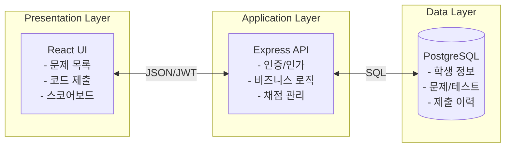
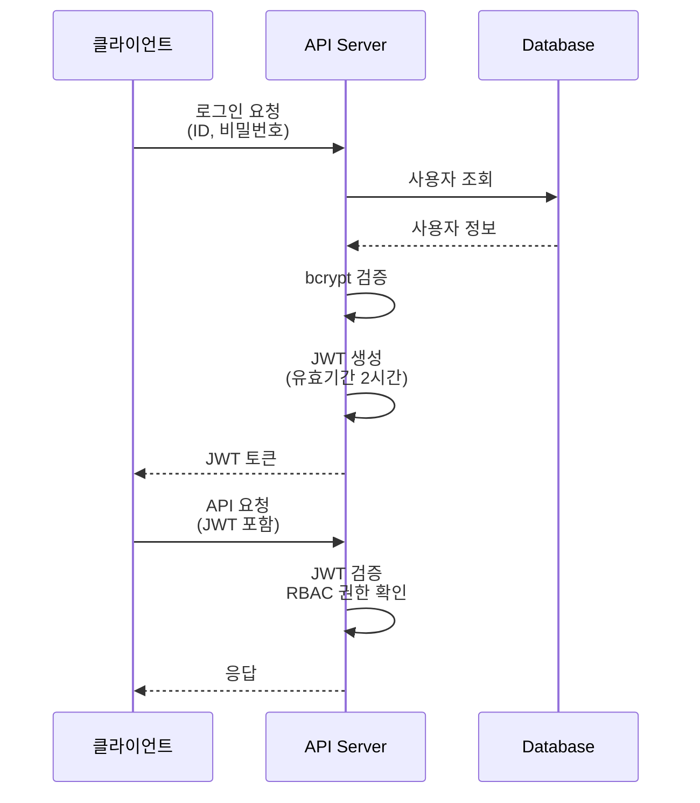
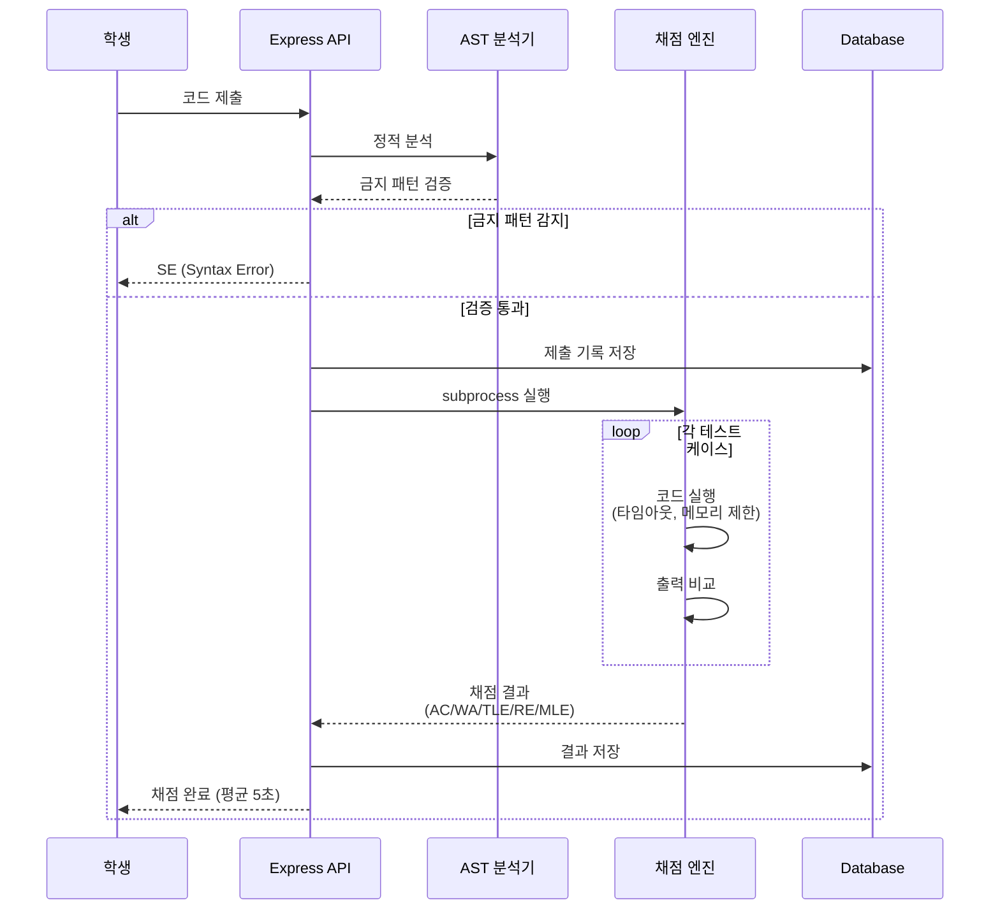
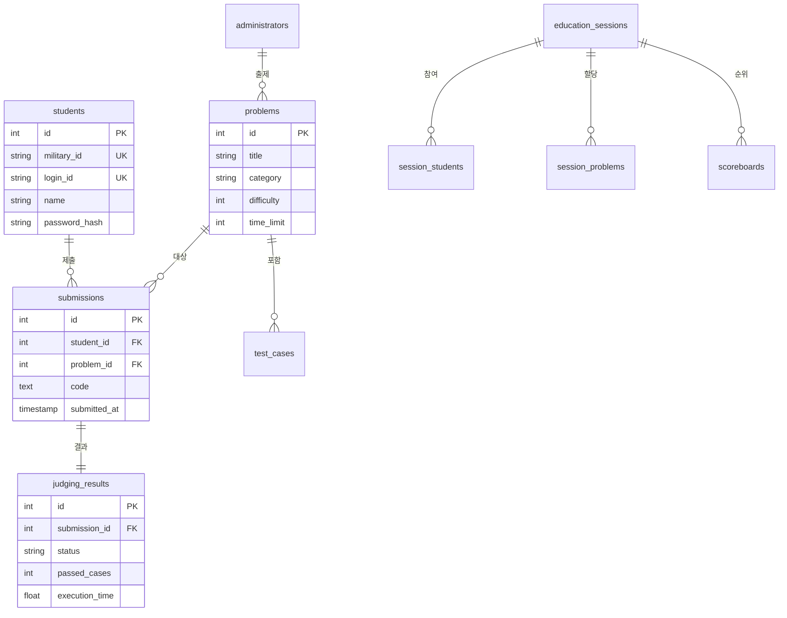
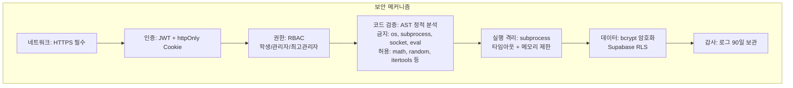
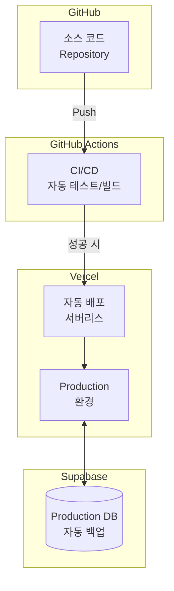

# Python Judge 기술 아키텍처 다이어그램

**버전**: 1.0
**작성일**: 2025-11-26
**기반 문서**: 2-product-requirements-document.md

---

## 1. 전체 시스템 아키텍처

```mermaid
graph TB
    subgraph "클라이언트"
        Client[웹 브라우저<br/>Chrome/Firefox/Edge]
    end

    subgraph "Vercel 서버리스"
        Frontend[React Frontend<br/>Tailwind CSS]
        Backend[Express API<br/>Node.js]
        Judge[채점 엔진<br/>(subprocess, Python 3.8-3.12)]
    end

    subgraph "Supabase"
        DB[(PostgreSQL<br/>Database)]
    end

    Client -->|HTTPS| Frontend
    Frontend -->|REST API| Backend
    Backend -->|SQL Query| DB
    Backend -->|코드 실행| Judge
    Judge -.->|결과 반환| Backend
```

---

## 2. 3-Tier 아키텍처



---

## 3. 인증 흐름



---

## 4. 채점 프로세스



---

## 5. 데이터 모델 (간소화)



---

## 6. 보안 계층



---

## 7. 배포 아키텍처



---

## 8. 기술 스택 요약

| 계층 | 기술 | 역할 |
|------|------|------|
| **Frontend** | React + Tailwind CSS | UI 렌더링, 사용자 인터랙션 |
| **Backend** | Node.js + Express | REST API, 비즈니스 로직 |
| **Database** | PostgreSQL (Supabase) | 데이터 저장 및 관리 |
| **채점** | subprocess (Python 3.8-3.12) | 코드 실행 및 채점 |
| **인증** | JWT | 무상태 인증 (2시간 유효) |
| **보안** | AST + subprocess | 코드 정적 분석 + 프로세스 격리 |
| **배포** | Vercel | 서버리스 자동 스케일링 |
| **CI/CD** | GitHub Actions | 자동 테스트 및 배포 |
| **버전 관리** | GitHub | 소스 코드 관리 및 협업 |
| **보안 모듈** | AST + 금지 모듈 차단 | os, subprocess, socket, eval 등 차단 |

---

## 9. 주요 특징

### 9.1 서버리스 아키텍처
- Vercel Functions로 자동 스케일링
- 사용량 기반 과금
- 인프라 관리 불필요

### 9.2 Stateless 설계
- JWT 기반 무상태 인증
- 수평 확장 용이
- 세션 저장소 불필요

### 9.3 보안 우선
- AST 정적 분석으로 악성 코드 사전 차단
- subprocess 프로세스 격리
- 타임아웃 및 메모리 제한
- RBAC 권한 관리

### 9.4 실시간 피드백
- 평균 5초 이내 채점 완료
- 폴링 방식 스코어보드 업데이트 (3-5초 간격)
- 즉각적인 학습 피드백

### 9.5 성능 목표
- 채점 응답 시간: 평균 5초, 최대 30초
- API 응답 시간: 95% 요청 1초 이내
- 동시 접속 처리: 30명
- 동시 제출 처리: 채점 큐 최대 500개

---

## 10. 주요 제약사항

### 10.1 기술적 제약사항

| 제약사항 | 영향 | 대응 방안 |
|---------|------|----------|
| **Docker 사용 불가** | 컨테이너 격리 불가능 | subprocess 프로세스 격리 + AST 정적 분석 |
| **Vercel WebSocket 미지원** | 실시간 양방향 통신 불가 | 폴링 방식 (3-5초 간격) 스코어보드 업데이트 |
| **Vercel 함수 타임아웃** | Hobby 10초, Pro 60초 | 채점 시간 최적화, 필요 시 Pro 플랜 전환 |
| **Vercel 함수 메모리** | 최대 1024MB | 채점 엔진 메모리 최적화 |

### 10.2 보안 정책

| 항목 | 금지 | 허용 |
|------|------|------|
| **모듈** | os, subprocess, socket, urllib, eval, exec | math, random, itertools, collections, string, re, datetime, json 등 |
| **파일 I/O** | 시스템 파일 접근 | 임시 디렉토리만 허용 |
| **네트워크** | 모든 네트워크 통신 | 차단 |

---

**문서 종료**
