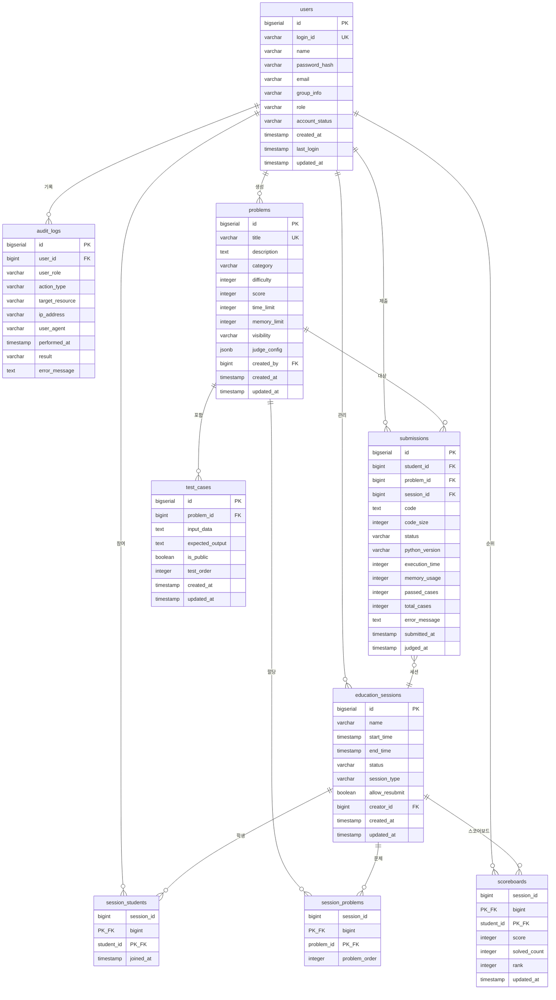

# Python Judge ERD (Entity Relationship Diagram)

**버전**: 2.0
**작성일**: 2025-11-27
**기반 문서**: 2-product-requirements-document.md
**변경 이력**: students/administrators 테이블 통합 → users, judging_results 제거 → submissions 통합

---

## 1. 전체 ERD

---

## 2. 엔티티 상세 설명

### 2.1 users (사용자 통합 테이블)

**용도**: 학생, 관리자, 슈퍼관리자 통합 관리 (Role-Based Access Control)

| 필드명         | 타입         | 제약조건                    | 설명                                 |
| -------------- | ------------ | --------------------------- | ------------------------------------ |
| id             | bigserial    | PK                          | 사용자 고유 ID                       |
| login_id       | varchar(20)  | NOT NULL, UNIQUE            | 로그인 ID (4-20자)                   |
| name           | varchar(50)  | NOT NULL                    | 이름 (2-50자)                        |
| password_hash  | varchar(100) | NOT NULL                    | bcrypt 암호화 비밀번호               |
| email          | varchar(100) | NULL                        | 이메일 (선택)                        |
| group_info     | varchar(50)  | NULL                        | 소속 그룹 (학생만)                   |
| role           | varchar(20)  | NOT NULL, DEFAULT 'student' | 역할 (student/admin/super_admin)     |
| account_status | varchar(20)  | NOT NULL, DEFAULT 'active'  | 계정 상태 (active/suspended/deleted) |
| created_at     | timestamp    | NOT NULL, DEFAULT NOW()     | 가입일                               |
| last_login     | timestamp    | NULL                        | 마지막 로그인                        |
| updated_at     | timestamp    | NOT NULL, DEFAULT NOW()     | 수정일                               |

**설계 특징**:

- students, administrators 테이블을 하나로 통합
- role 컬럼으로 역할 구분 (RBAC 패턴)
- 모든 사용자가 하나의 테이블에서 관리되어 인증/인가 로직 단순화

### 2.2 problems (문제)

**용도**: 알고리즘 코딩 문제 저장

| 필드명       | 타입         | 제약조건                  | 설명                                      |
| ------------ | ------------ | ------------------------- | ----------------------------------------- |
| id           | bigserial    | PK                        | 문제 고유 ID                              |
| title        | varchar(200) | NOT NULL, UNIQUE          | 문제 제목                                 |
| description  | text         | NOT NULL                  | 문제 설명 (마크다운)                      |
| category     | varchar(50)  | NOT NULL                  | 카테고리 (입출력/조건문/반복문/리스트 등) |
| difficulty   | integer      | NOT NULL, CHECK 1-5       | 난이도 (1-5)                              |
| score        | integer      | NOT NULL, DEFAULT 1, CHECK >0 | 문제 점수(기본 1점)                      |
| time_limit   | integer      | NOT NULL, CHECK 1-10      | 시간 제한 (초)                            |
| memory_limit | integer      | NOT NULL, DEFAULT 256     | 메모리 제한 (MB)                          |
| visibility   | varchar(20)  | NOT NULL, DEFAULT 'draft' | 공개 상태 (public/private/draft)          |
| judge_config | jsonb        | NULL                      | 채점 설정 (JSON)                          |
| created_by   | bigint       | FK → users                | 작성자 ID                                 |
| created_at   | timestamp    | NOT NULL, DEFAULT NOW()   | 생성일                                    |
| updated_at   | timestamp    | NOT NULL, DEFAULT NOW()   | 수정일                                    |

**카테고리 값**: '입출력', '조건문', '반복문', '리스트', '문자열', '함수', '재귀', '정렬', '탐색', '동적계획법', '기타'

### 2.3 test_cases (테스트 케이스)

**용도**: 문제별 입출력 테스트 케이스 저장

| 필드명          | 타입      | 제약조건                | 설명             |
| --------------- | --------- | ----------------------- | ---------------- |
| id              | bigserial | PK                      | 테스트 케이스 ID |
| problem_id      | bigint    | NOT NULL, FK → problems | 문제 ID          |
| input_data      | text      | NOT NULL                | 입력 데이터      |
| expected_output | text      | NOT NULL                | 예상 출력        |
| is_public       | boolean   | NOT NULL, DEFAULT false | 공개 여부        |
| test_order      | integer   | NOT NULL                | 실행 순서        |
| created_at      | timestamp | NOT NULL, DEFAULT NOW() | 생성일           |
| updated_at      | timestamp | NOT NULL, DEFAULT NOW() | 수정일           |

### 2.4 submissions (제출 및 채점 결과 통합)

**용도**: 학생의 코드 제출 및 채점 결과를 하나의 테이블에서 관리

| 필드명         | 타입        | 제약조건                      | 설명                                            |
| -------------- | ----------- | ----------------------------- | ----------------------------------------------- |
| id             | bigserial   | PK                            | 제출 ID                                         |
| student_id     | bigint      | NOT NULL, FK → users          | 학생 ID                                         |
| problem_id     | bigint      | NOT NULL, FK → problems       | 문제 ID                                         |
| session_id     | bigint      | NULL, FK → education_sessions | 세션 ID (선택)                                  |
| code           | text        | NOT NULL                      | 제출 코드 (최대 64KB)                           |
| code_size      | integer     | NOT NULL, CHECK ≤65536        | 코드 크기 (bytes)                               |
| status         | varchar(20) | NOT NULL, DEFAULT 'pending'   | 채점 상태 (pending/judging/AC/WA/TLE/RE/SE/MLE) |
| python_version | varchar(10) | NOT NULL                      | Python 버전 (3.8-3.12)                          |
| execution_time | integer     | NULL                          | 실행 시간 (ms)                                  |
| memory_usage   | integer     | NULL                          | 메모리 사용량 (MB)                              |
| passed_cases   | integer     | NULL                          | 통과 케이스 수                                  |
| total_cases    | integer     | NULL                          | 전체 케이스 수                                  |
| error_message  | text        | NULL                          | 에러 메시지                                     |
| submitted_at   | timestamp   | NOT NULL, DEFAULT NOW()       | 제출 시각                                       |
| judged_at      | timestamp   | NULL                          | 채점 완료 시각                                  |

**설계 특징**:

- 기존 submissions + judging_results 테이블 통합
- status 필드가 제출 상태와 채점 결과를 모두 표현
- pending/judging: 채점 진행 중 상태
- AC/WA/TLE/RE/SE/MLE: 채점 완료 후 최종 결과
- 1:1 관계였던 judging_results를 제거하여 조인 비용 감소

**상태 코드**:

- **pending**: 채점 대기
- **judging**: 채점 진행 중
- **AC** (Accepted): 정답
- **WA** (Wrong Answer): 오답
- **TLE** (Time Limit Exceeded): 시간 초과
- **RE** (Runtime Error): 런타임 에러
- **SE** (System Error): 시스템 에러
- **MLE** (Memory Limit Exceeded): 메모리 초과

### 2.5 education_sessions (교육 세션)

**용도**: 교육 과정 또는 평가 세션 관리

| 필드명         | 타입         | 제약조건                      | 설명                                         |
| -------------- | ------------ | ----------------------------- | -------------------------------------------- |
| id             | bigserial    | PK                            | 세션 ID                                      |
| name           | varchar(100) | NOT NULL                      | 세션 이름                                    |
| start_time     | timestamp    | NOT NULL                      | 시작 시각                                    |
| end_time       | timestamp    | NOT NULL, CHECK >start_time   | 종료 시각                                    |
| status         | varchar(20)  | NOT NULL, DEFAULT 'scheduled' | 세션 상태 (scheduled/active/ended/cancelled) |
| session_type   | varchar(20)  | NOT NULL                      | 세션 타입 (regular/exam/practice)            |
| allow_resubmit | boolean      | NOT NULL, DEFAULT true        | 재제출 허용 여부                             |
| creator_id     | bigint       | NULL, FK → users              | 생성자 ID                                    |
| created_at     | timestamp    | NOT NULL, DEFAULT NOW()       | 생성일                                       |
| updated_at     | timestamp    | NOT NULL, DEFAULT NOW()       | 수정일                                       |

### 2.6 session_students (세션-학생 매핑)

**용도**: 세션 참여 학생 목록 (N:M)

| 필드명     | 타입      | 제약조건                    | 설명      |
| ---------- | --------- | --------------------------- | --------- |
| session_id | bigint    | PK, FK → education_sessions | 세션 ID   |
| student_id | bigint    | PK, FK → users              | 학생 ID   |
| joined_at  | timestamp | NOT NULL, DEFAULT NOW()     | 참여 시각 |

### 2.7 session_problems (세션-문제 매핑)

**용도**: 세션 할당 문제 목록 (N:M)

| 필드명        | 타입    | 제약조건                    | 설명      |
| ------------- | ------- | --------------------------- | --------- |
| session_id    | bigint  | PK, FK → education_sessions | 세션 ID   |
| problem_id    | bigint  | PK, FK → problems           | 문제 ID   |
| problem_order | integer | NOT NULL                    | 문제 순서 |

### 2.8 scoreboards (스코어보드)

**용도**: 세션별 실시간 학생 순위 및 점수

| 필드명       | 타입      | 제약조건                      | 설명                 |
| ------------ | --------- | ----------------------------- | -------------------- |
| session_id   | bigint    | PK, FK → education_sessions   | 세션 ID              |
| student_id   | bigint    | PK, FK → users                | 학생 ID              |
| score        | integer   | NOT NULL, DEFAULT 0, CHECK ≥0 | 총 점수 (AC당 100점) |
| solved_count | integer   | NOT NULL, DEFAULT 0, CHECK ≥0 | 해결 문제 수         |
| rank         | integer   | NOT NULL, DEFAULT 1, CHECK >0 | 순위                 |
| updated_at   | timestamp | NOT NULL, DEFAULT NOW()       | 마지막 업데이트      |

### 2.9 audit_logs (감사 로그)

**용도**: 중요 행위 기록 및 보안 감사

| 필드명          | 타입         | 제약조건                | 설명                                                               |
| --------------- | ------------ | ----------------------- | ------------------------------------------------------------------ |
| id              | bigserial    | PK                      | 로그 ID                                                            |
| user_id         | bigint       | NULL                    | 사용자 ID                                                          |
| user_role       | varchar(20)  | NULL                    | 사용자 역할 (student/admin/super_admin/unknown)                    |
| action_type     | varchar(50)  | NOT NULL                | 행위 타입 (login/signup/create/update/delete/submit/access_denied) |
| target_resource | varchar(100) | NULL                    | 대상 리소스                                                        |
| ip_address      | varchar(45)  | NULL                    | IP 주소                                                            |
| user_agent      | varchar(200) | NULL                    | User Agent                                                         |
| performed_at    | timestamp    | NOT NULL, DEFAULT NOW() | 수행 시각                                                          |
| result          | varchar(20)  | NOT NULL                | 결과 (success/failure)                                             |
| error_message   | text         | NULL                    | 에러 메시지                                                        |

**행위 타입**: login, signup, create, update, delete, submit, reset_password, change_password, access_denied

---

## 3. 관계 설명

| 관계                                  | 타입 | 외래키                        | CASCADE 규칙       | 설명                               |
| ------------------------------------- | ---- | ----------------------------- | ------------------ | ---------------------------------- |
| users → submissions                   | 1:N  | submissions.student_id        | ON DELETE RESTRICT | 사용자가 제출한 코드 (학생 역할)   |
| users → session_students              | 1:N  | session_students.student_id   | ON DELETE CASCADE  | 사용자가 참여한 세션 (학생 역할)   |
| users → scoreboards                   | 1:N  | scoreboards.student_id        | ON DELETE CASCADE  | 사용자의 세션별 순위 (학생 역할)   |
| users → audit_logs                    | 1:N  | audit_logs.user_id            | ON DELETE RESTRICT | 사용자의 행위 기록 (모든 역할)     |
| users → problems                      | 1:N  | problems.created_by           | ON DELETE SET NULL | 사용자가 생성한 문제 (관리자 역할) |
| users → education_sessions            | 1:N  | education_sessions.creator_id | ON DELETE SET NULL | 사용자가 생성한 세션 (관리자 역할) |
| problems → test_cases                 | 1:N  | test_cases.problem_id         | ON DELETE CASCADE  | 문제의 테스트 케이스               |
| problems → submissions                | 1:N  | submissions.problem_id        | ON DELETE RESTRICT | 문제에 대한 제출                   |
| problems → session_problems           | 1:N  | session_problems.problem_id   | ON DELETE CASCADE  | 세션에 할당된 문제                 |
| education_sessions → submissions      | 1:N  | submissions.session_id        | ON DELETE SET NULL | 세션 내 제출 (선택적)              |
| education_sessions → session_students | 1:N  | session_students.session_id   | ON DELETE CASCADE  | 세션 참여 학생                     |
| education_sessions → session_problems | 1:N  | session_problems.session_id   | ON DELETE CASCADE  | 세션 할당 문제                     |
| education_sessions → scoreboards      | 1:N  | scoreboards.session_id        | ON DELETE CASCADE  | 세션별 스코어보드                  |

**주요 변경 사항**:

- students/administrators → users 통합으로 모든 FK가 users 참조
- submissions → judging_results 1:1 관계 제거 (테이블 통합)
- 문제 점수 컬럼 추가(`problems.score`), 스코어는 문제 정답 시 해당 점수를 누적 (기본 1점)

---

## 4. 인덱스 전략

### 4.1 기본 인덱스 (자동 생성)

| 테이블             | 인덱스                   | 타입    |
| ------------------ | ------------------------ | ------- |
| users              | id                       | PK      |
| users              | login_id                 | UNIQUE  |
| problems           | id                       | PK      |
| problems           | title                    | UNIQUE  |
| test_cases         | id                       | PK      |
| submissions        | id                       | PK      |
| education_sessions | id                       | PK      |
| session_students   | (session_id, student_id) | 복합 PK |
| session_problems   | (session_id, problem_id) | 복합 PK |
| scoreboards        | (session_id, student_id) | 복합 PK |
| audit_logs         | id                       | PK      |

### 4.2 성능 최적화 인덱스

| 인덱스명                          | 테이블             | 컬럼                                        | 용도                    |
| --------------------------------- | ------------------ | ------------------------------------------- | ----------------------- |
| idx_users_role                    | users              | role                                        | 역할별 사용자 조회      |
| idx_users_account_status          | users              | account_status                              | 계정 상태 필터링        |
| idx_users_login_id                | users              | login_id                                    | 로그인 조회 최적화      |
| idx_problems_created_by           | problems           | created_by                                  | FK 조회                 |
| idx_problems_category             | problems           | category                                    | 카테고리 필터링         |
| idx_problems_difficulty           | problems           | difficulty                                  | 난이도 필터링           |
| idx_problems_visibility           | problems           | visibility                                  | 공개 상태 필터링        |
| idx_test_cases_problem_id         | test_cases         | problem_id                                  | FK 조회                 |
| idx_test_cases_problem_order      | test_cases         | (problem_id, test_order)                    | 순서 조회               |
| idx_submissions_student_id        | submissions        | student_id                                  | FK 조회                 |
| idx_submissions_problem_id        | submissions        | problem_id                                  | FK 조회                 |
| idx_submissions_session_id        | submissions        | session_id                                  | FK 조회                 |
| idx_submissions_status            | submissions        | status                                      | 상태 필터링             |
| idx_submissions_submitted_at      | submissions        | submitted_at DESC                           | 최신순 정렬             |
| idx_submissions_student_problem   | submissions        | (student_id, problem_id, submitted_at DESC) | 학생별 문제별 제출 이력 |
| idx_education_sessions_creator_id | education_sessions | creator_id                                  | FK 조회                 |
| idx_education_sessions_status     | education_sessions | status                                      | 상태 필터링             |
| idx_education_sessions_start_time | education_sessions | start_time                                  | 시간 기준 조회          |
| idx_scoreboards_session_rank      | scoreboards        | (session_id, rank)                          | 순위 정렬               |
| idx_audit_logs_user_id            | audit_logs         | user_id                                     | FK 조회                 |
| idx_audit_logs_performed_at       | audit_logs         | performed_at DESC                           | 시간순 정렬             |
| idx_audit_logs_action_type        | audit_logs         | action_type                                 | 행위 타입 필터링        |

**제거된 인덱스**:

- `idx_judging_results_*` (테이블 제거로 인한 삭제)

---

## 5. 데이터 무결성 규칙

### 5.1 CHECK 제약조건

| 테이블             | 제약조건명                     | 조건                                                                                                                             |
| ------------------ | ------------------------------ | -------------------------------------------------------------------------------------------------------------------------------- |
| users              | chk_users_login_id_length      | char_length(login_id) BETWEEN 4 AND 20                                                                                           |
| users              | chk_users_name_length          | char_length(name) BETWEEN 2 AND 50                                                                                               |
| users              | chk_users_role                 | role IN ('student', 'admin', 'super_admin')                                                                                      |
| users              | chk_users_account_status       | account_status IN ('active', 'suspended', 'deleted')                                                                             |
| problems           | chk_problems_difficulty        | difficulty BETWEEN 1 AND 5                                                                                                       |
| problems           | chk_problems_time_limit        | time_limit BETWEEN 1 AND 10                                                                                                      |
| problems           | chk_problems_memory_limit      | memory_limit > 0                                                                                                                 |
| problems           | chk_problems_visibility        | visibility IN ('public', 'private', 'draft')                                                                                     |
| problems           | chk_problems_category          | category IN ('입출력', '조건문', '반복문', '리스트', '문자열', '함수', '재귀', '정렬', '탐색', '동적계획법', '기타')             |
| submissions        | chk_submissions_code_size      | code_size <= 65536                                                                                                               |
| submissions        | chk_submissions_status         | status IN ('pending', 'judging', 'AC', 'WA', 'TLE', 'RE', 'SE', 'MLE')                                                           |
| submissions        | chk_submissions_python_version | python_version IN ('3.8', '3.9', '3.10', '3.11', '3.12')                                                                         |
| education_sessions | chk_education_sessions_status  | status IN ('scheduled', 'active', 'ended', 'cancelled')                                                                          |
| education_sessions | chk_education_sessions_type    | session_type IN ('regular', 'exam', 'practice')                                                                                  |
| education_sessions | chk_education_sessions_time    | end_time > start_time                                                                                                            |
| scoreboards        | chk_scoreboards_score          | score >= 0                                                                                                                       |
| scoreboards        | chk_scoreboards_solved_count   | solved_count >= 0                                                                                                                |
| scoreboards        | chk_scoreboards_rank           | rank > 0                                                                                                                         |
| audit_logs         | chk_audit_logs_user_role       | user_role IN ('student', 'admin', 'super_admin', 'unknown')                                                                      |
| audit_logs         | chk_audit_logs_action_type     | action_type IN ('login', 'signup', 'create', 'update', 'delete', 'submit', 'reset_password', 'change_password', 'access_denied') |
| audit_logs         | chk_audit_logs_result          | result IN ('success', 'failure')                                                                                                 |

**주요 변경 사항**:

- students/administrators 제약조건 → users 통합
- judging_results 관련 제약조건 제거
- submissions.status에 채점 결과 상태 추가 (AC/WA/TLE/RE/SE/MLE)

### 5.2 트리거

| 트리거명                          | 테이블             | 이벤트        | 기능                 |
| --------------------------------- | ------------------ | ------------- | -------------------- |
| trg_users_updated_at              | users              | BEFORE UPDATE | updated_at 자동 갱신 |
| trg_problems_updated_at           | problems           | BEFORE UPDATE | updated_at 자동 갱신 |
| trg_test_cases_updated_at         | test_cases         | BEFORE UPDATE | updated_at 자동 갱신 |
| trg_education_sessions_updated_at | education_sessions | BEFORE UPDATE | updated_at 자동 갱신 |

**참고**: 스코어보드 업데이트 및 순위 재계산은 애플리케이션 레벨에서 처리

### 5.3 비즈니스 규칙

| 규칙                      | 설명                                                          |
| ------------------------- | ------------------------------------------------------------- |
| Role-Based Access Control | users.role 기반 권한 제어 (student/admin/super_admin)         |
| 중복 제출 차단            | 5초 이내 동일 문제 중복 제출 불가 (애플리케이션 레벨)         |
| 금지 모듈 검증            | 제출 시 AST 파싱으로 os, subprocess, socket 등 금지 모듈 검사 |
| Soft Delete               | account_status='deleted'로 처리, 제출 이력 보존               |
| 세션 상태 자동 전환       | 현재 시각 기준으로 scheduled → active → ended 자동 전환       |
| 스코어보드 동점 처리      | 동점 시 먼저 제출한 학생 우선 (updated_at 기준)               |
| 감사 로그 보관            | 90일 자동 삭제                                                |
| 테스트 케이스 구성        | 공개 1-3개, 비공개 10-50개 권장                               |
| 채점 결과 통합 관리       | submissions 테이블에 제출 정보와 채점 결과 통합 저장          |

---

## 6. 통합 설계의 장점

### 6.1 users 테이블 통합 (students + administrators)

**장점**:

- 인증/인가 로직 단순화 (하나의 테이블에서 사용자 조회)
- 역할 변경 용이 (UPDATE users SET role = 'admin')
- 세션 관리 및 감사 로그 간소화
- 애플리케이션 코드 복잡도 감소

**단점 및 대응**:

- 학생 전용 필드(group_info) 일부 NULL 허용
  → CHECK 제약조건으로 role='student'일 때 필수 검증 (애플리케이션 레벨)

### 6.2 submissions 테이블 통합 (submissions + judging_results)

**장점**:

- 1:1 관계 제거로 조인 비용 감소
- 제출과 결과를 원자적으로 관리
- 쿼리 복잡도 감소 (하나의 테이블에서 모든 정보 조회)
- 트랜잭션 관리 단순화

**단점 및 대응**:

- 채점 전 NULL 필드 존재 (execution_time, memory_usage 등)
  → status='pending'/'judging'일 때 정상 동작
- 테이블 크기 약간 증가
  → 실제 영향 미미, 인덱스 최적화로 해결

---

**문서 종료**
