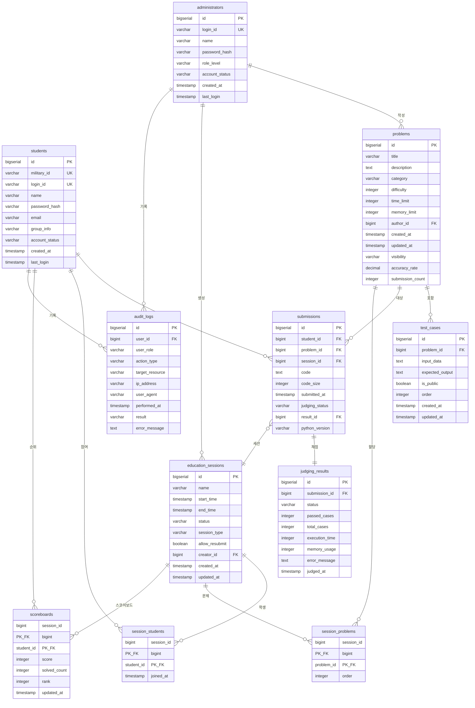

# Python Judge ERD (Entity Relationship Diagram)

**버전**: 1.0
**작성일**: 2025-11-26
**기반 문서**: 2-product-requirements-document.md

---

## 1. 전체 ERD

---

## 2. 엔티티 상세 설명

### 2.1 students (학생)

**용도**: 학생 정보 관리

| 필드명 | 타입 | 제약조건 | 설명 |
|--------|------|----------|------|
| id | bigserial | PK | 학생 고유 ID |
| military_id | varchar(20) | NOT NULL, UNIQUE | 군번 (영문/숫자/하이픈 5-20자) |
| login_id | varchar(20) | NOT NULL, UNIQUE | 로그인 ID (4-20자) |
| name | varchar(50) | NOT NULL | 이름 (2-50자) |
| password_hash | varchar(100) | NOT NULL | bcrypt 암호화 비밀번호 |
| email | varchar(100) | NULL | 이메일 (선택) |
| group_info | varchar(50) | NULL | 소속 그룹 |
| account_status | varchar(20) | NOT NULL, DEFAULT 'active' | 계정 상태 (active/suspended/deleted) |
| created_at | timestamp | NOT NULL, DEFAULT NOW() | 가입일 |
| last_login | timestamp | NULL | 마지막 로그인 |

### 2.2 administrators (관리자)

**용도**: 관리자 정보 관리

| 필드명 | 타입 | 제약조건 | 설명 |
|--------|------|----------|------|
| id | bigserial | PK | 관리자 고유 ID |
| login_id | varchar(20) | NOT NULL, UNIQUE | 로그인 ID |
| name | varchar(50) | NOT NULL | 이름 |
| password_hash | varchar(100) | NOT NULL | bcrypt 암호화 비밀번호 |
| role_level | varchar(20) | NOT NULL | 권한 레벨 (admin/super_admin) |
| account_status | varchar(20) | NOT NULL, DEFAULT 'active' | 계정 상태 |
| created_at | timestamp | NOT NULL, DEFAULT NOW() | 생성일 |
| last_login | timestamp | NULL | 마지막 로그인 |

### 2.3 problems (문제)

**용도**: 알고리즘 코딩 문제 저장

| 필드명 | 타입 | 제약조건 | 설명 |
|--------|------|----------|------|
| id | bigserial | PK | 문제 고유 ID |
| title | varchar(200) | NOT NULL | 문제 제목 |
| description | text | NOT NULL | 문제 설명 (마크다운) |
| category | varchar(50) | NOT NULL | 카테고리 (조건문/반복문/리스트 등) |
| difficulty | integer | NOT NULL, CHECK 1-5 | 난이도 (1-5) |
| time_limit | integer | NOT NULL, CHECK 1-10 | 시간 제한 (초) |
| memory_limit | integer | NOT NULL, DEFAULT 256 | 메모리 제한 (MB) |
| author_id | bigint | FK → administrators | 작성자 ID |
| created_at | timestamp | NOT NULL, DEFAULT NOW() | 생성일 |
| updated_at | timestamp | NOT NULL, DEFAULT NOW() | 수정일 |
| visibility | varchar(20) | NOT NULL, DEFAULT 'draft' | 공개 상태 (public/private/draft) |
| accuracy_rate | decimal(5,2) | NOT NULL, DEFAULT 0 | 정답률 (0-100%) |
| submission_count | integer | NOT NULL, DEFAULT 0 | 총 제출 수 |

### 2.4 test_cases (테스트 케이스)

**용도**: 문제별 입출력 테스트 케이스 저장

| 필드명 | 타입 | 제약조건 | 설명 |
|--------|------|----------|------|
| id | bigserial | PK | 테스트 케이스 ID |
| problem_id | bigint | NOT NULL, FK → problems | 문제 ID |
| input_data | text | NOT NULL | 입력 데이터 |
| expected_output | text | NOT NULL | 예상 출력 |
| is_public | boolean | NOT NULL, DEFAULT false | 공개 여부 |
| order | integer | NOT NULL | 실행 순서 |
| created_at | timestamp | NOT NULL, DEFAULT NOW() | 생성일 |
| updated_at | timestamp | NOT NULL, DEFAULT NOW() | 수정일 |

### 2.5 submissions (제출)

**용도**: 학생의 코드 제출 이력 저장

| 필드명 | 타입 | 제약조건 | 설명 |
|--------|------|----------|------|
| id | bigserial | PK | 제출 ID |
| student_id | bigint | NOT NULL, FK → students | 학생 ID |
| problem_id | bigint | NOT NULL, FK → problems | 문제 ID |
| session_id | bigint | NULL, FK → education_sessions | 세션 ID (선택) |
| code | text | NOT NULL | 제출 코드 (최대 64KB) |
| code_size | integer | NOT NULL, CHECK ≤65536 | 코드 크기 (bytes) |
| submitted_at | timestamp | NOT NULL, DEFAULT NOW() | 제출 시각 |
| judging_status | varchar(20) | NOT NULL, DEFAULT 'pending' | 채점 상태 (pending/judging/completed/failed) |
| result_id | bigint | NULL, FK → judging_results | 채점 결과 ID |
| python_version | varchar(10) | NOT NULL | Python 버전 (3.8-3.12) |

### 2.6 judging_results (채점 결과)

**용도**: 제출 코드의 채점 결과 저장

| 필드명 | 타입 | 제약조건 | 설명 |
|--------|------|----------|------|
| id | bigserial | PK | 채점 결과 ID |
| submission_id | bigint | NOT NULL, UNIQUE, FK → submissions | 제출 ID (1:1) |
| status | varchar(10) | NOT NULL | 최종 상태 (AC/WA/TLE/RE/SE/MLE) |
| passed_cases | integer | NOT NULL, CHECK ≥0 | 통과 케이스 수 |
| total_cases | integer | NOT NULL, CHECK >0 | 전체 케이스 수 |
| execution_time | integer | NOT NULL, CHECK ≥0 | 실행 시간 (ms) |
| memory_usage | integer | NOT NULL, CHECK ≥0 | 메모리 사용량 (MB) |
| error_message | text | NULL | 에러 메시지 |
| judged_at | timestamp | NOT NULL, DEFAULT NOW() | 채점 완료 시각 |

### 2.7 education_sessions (교육 세션)

**용도**: 교육 과정 또는 평가 세션 관리

| 필드명 | 타입 | 제약조건 | 설명 |
|--------|------|----------|------|
| id | bigserial | PK | 세션 ID |
| name | varchar(100) | NOT NULL | 세션 이름 |
| start_time | timestamp | NOT NULL | 시작 시각 |
| end_time | timestamp | NOT NULL, CHECK >start_time | 종료 시각 |
| status | varchar(20) | NOT NULL, DEFAULT 'scheduled' | 세션 상태 (scheduled/active/ended/cancelled) |
| session_type | varchar(20) | NOT NULL | 세션 타입 (regular/exam/practice) |
| allow_resubmit | boolean | NOT NULL, DEFAULT true | 재제출 허용 여부 |
| creator_id | bigint | NULL, FK → administrators | 생성자 ID |
| created_at | timestamp | NOT NULL, DEFAULT NOW() | 생성일 |
| updated_at | timestamp | NOT NULL, DEFAULT NOW() | 수정일 |

### 2.8 session_students (세션-학생 매핑)

**용도**: 세션 참여 학생 목록 (N:M)

| 필드명 | 타입 | 제약조건 | 설명 |
|--------|------|----------|------|
| session_id | bigint | PK, FK → education_sessions | 세션 ID |
| student_id | bigint | PK, FK → students | 학생 ID |
| joined_at | timestamp | NOT NULL, DEFAULT NOW() | 참여 시각 |

### 2.9 session_problems (세션-문제 매핑)

**용도**: 세션 할당 문제 목록 (N:M)

| 필드명 | 타입 | 제약조건 | 설명 |
|--------|------|----------|------|
| session_id | bigint | PK, FK → education_sessions | 세션 ID |
| problem_id | bigint | PK, FK → problems | 문제 ID |
| order | integer | NOT NULL | 문제 순서 |

### 2.10 scoreboards (스코어보드)

**용도**: 세션별 실시간 학생 순위 및 점수

| 필드명 | 타입 | 제약조건 | 설명 |
|--------|------|----------|------|
| session_id | bigint | PK, FK → education_sessions | 세션 ID |
| student_id | bigint | PK, FK → students | 학생 ID |
| score | integer | NOT NULL, DEFAULT 0, CHECK ≥0 | 총 점수 (AC당 100점) |
| solved_count | integer | NOT NULL, DEFAULT 0, CHECK ≥0 | 해결 문제 수 |
| rank | integer | NOT NULL, DEFAULT 0, CHECK >0 | 순위 |
| updated_at | timestamp | NOT NULL, DEFAULT NOW() | 마지막 업데이트 |

### 2.11 audit_logs (감사 로그)

**용도**: 중요 행위 기록 및 보안 감사

| 필드명 | 타입 | 제약조건 | 설명 |
|--------|------|----------|------|
| id | bigserial | PK | 로그 ID |
| user_id | bigint | NOT NULL | 사용자 ID |
| user_role | varchar(20) | NOT NULL | 사용자 역할 (student/admin/super_admin) |
| action_type | varchar(50) | NOT NULL | 행위 타입 (login/create/update/delete/submit/access_denied) |
| target_resource | varchar(100) | NULL | 대상 리소스 |
| ip_address | varchar(45) | NULL | IP 주소 |
| user_agent | varchar(200) | NULL | User Agent |
| performed_at | timestamp | NOT NULL, DEFAULT NOW() | 수행 시각 |
| result | varchar(20) | NOT NULL | 결과 (success/failure) |
| error_message | text | NULL | 에러 메시지 |

---

## 3. 관계 설명

| 관계 | 타입 | 외래키 | CASCADE 규칙 |
|------|------|--------|--------------|
| students → submissions | 1:N | submissions.student_id | ON DELETE RESTRICT |
| students → session_students | 1:N | session_students.student_id | ON DELETE CASCADE |
| students → scoreboards | 1:N | scoreboards.student_id | ON DELETE CASCADE |
| students → audit_logs | 1:N | audit_logs.user_id | ON DELETE RESTRICT |
| administrators → problems | 1:N | problems.author_id | ON DELETE SET NULL |
| administrators → education_sessions | 1:N | education_sessions.creator_id | ON DELETE SET NULL |
| administrators → audit_logs | 1:N | audit_logs.user_id | ON DELETE RESTRICT |
| problems → test_cases | 1:N | test_cases.problem_id | ON DELETE CASCADE |
| problems → submissions | 1:N | submissions.problem_id | ON DELETE RESTRICT |
| problems → session_problems | 1:N | session_problems.problem_id | ON DELETE CASCADE |
| submissions → judging_results | 1:1 | judging_results.submission_id | ON DELETE CASCADE |
| education_sessions → submissions | 1:N | submissions.session_id | ON DELETE SET NULL |
| education_sessions → session_students | 1:N | session_students.session_id | ON DELETE CASCADE |
| education_sessions → session_problems | 1:N | session_problems.session_id | ON DELETE CASCADE |
| education_sessions → scoreboards | 1:N | scoreboards.session_id | ON DELETE CASCADE |

---

## 4. 인덱스 전략

### 4.1 기본 인덱스 (자동 생성)

| 테이블 | 인덱스 | 타입 |
|--------|--------|------|
| students | id | PK |
| students | military_id | UNIQUE |
| students | login_id | UNIQUE |
| administrators | id | PK |
| administrators | login_id | UNIQUE |
| problems | id | PK |
| test_cases | id | PK |
| submissions | id | PK |
| judging_results | id | PK |
| judging_results | submission_id | UNIQUE |
| education_sessions | id | PK |
| session_students | (session_id, student_id) | 복합 PK |
| session_problems | (session_id, problem_id) | 복합 PK |
| scoreboards | (session_id, student_id) | 복합 PK |
| audit_logs | id | PK |

### 4.2 성능 최적화 인덱스

| 인덱스명 | 테이블 | 컬럼 | 용도 |
|----------|--------|------|------|
| idx_problems_author_id | problems | author_id | FK 조회 |
| idx_problems_category | problems | category | 카테고리 필터링 |
| idx_problems_difficulty | problems | difficulty | 난이도 필터링 |
| idx_problems_visibility | problems | visibility | 공개 상태 필터링 |
| idx_test_cases_problem_id | test_cases | problem_id | FK 조회 |
| idx_test_cases_problem_order | test_cases | (problem_id, order) | 순서 조회 |
| idx_submissions_student_id | submissions | student_id | FK 조회 |
| idx_submissions_problem_id | submissions | problem_id | FK 조회 |
| idx_submissions_session_id | submissions | session_id | FK 조회 |
| idx_submissions_submitted_at | submissions | submitted_at DESC | 최신순 정렬 |
| idx_submissions_student_problem | submissions | (student_id, problem_id, submitted_at DESC) | 학생별 문제별 제출 이력 |
| idx_submissions_session_student | submissions | (session_id, student_id, submitted_at DESC) | 세션별 학생 제출 조회 |
| idx_judging_results_submission_id | judging_results | submission_id | FK 조회 |
| idx_judging_results_status | judging_results | status | 상태 필터링 |
| idx_education_sessions_creator_id | education_sessions | creator_id | FK 조회 |
| idx_education_sessions_status | education_sessions | status | 상태 필터링 |
| idx_education_sessions_start_time | education_sessions | start_time | 시간 기준 조회 |
| idx_scoreboards_session_rank | scoreboards | (session_id, rank) | 순위 정렬 |
| idx_audit_logs_user_id | audit_logs | user_id | FK 조회 |
| idx_audit_logs_performed_at | audit_logs | performed_at DESC | 시간순 정렬 |
| idx_audit_logs_action_type | audit_logs | action_type | 행위 타입 필터링 |

---

## 5. 데이터 무결성 규칙

### 5.1 CHECK 제약조건

| 테이블 | 제약조건명 | 조건 |
|--------|------------|------|
| students | chk_students_military_id_length | char_length(military_id) BETWEEN 5 AND 20 |
| students | chk_students_login_id_length | char_length(login_id) BETWEEN 4 AND 20 |
| students | chk_students_name_length | char_length(name) BETWEEN 2 AND 50 |
| students | chk_students_account_status | account_status IN ('active', 'suspended', 'deleted') |
| administrators | chk_administrators_role_level | role_level IN ('admin', 'super_admin') |
| administrators | chk_administrators_account_status | account_status IN ('active', 'suspended', 'deleted') |
| problems | chk_problems_difficulty | difficulty BETWEEN 1 AND 5 |
| problems | chk_problems_time_limit | time_limit BETWEEN 1 AND 10 |
| problems | chk_problems_memory_limit | memory_limit > 0 |
| problems | chk_problems_visibility | visibility IN ('public', 'private', 'draft') |
| problems | chk_problems_accuracy_rate | accuracy_rate BETWEEN 0 AND 100 |
| problems | chk_problems_category | category IN ('조건문', '반복문', '리스트', '딕셔너리', '문자열', '함수', '재귀', '정렬', '파일 I/O', '예외 처리', '종합') |
| submissions | chk_submissions_code_size | code_size <= 65536 |
| submissions | chk_submissions_judging_status | judging_status IN ('pending', 'judging', 'completed', 'failed') |
| submissions | chk_submissions_python_version | python_version IN ('3.8', '3.9', '3.10', '3.11', '3.12') |
| judging_results | chk_judging_results_status | status IN ('AC', 'WA', 'TLE', 'RE', 'SE', 'MLE') |
| judging_results | chk_judging_results_passed_cases | passed_cases >= 0 AND passed_cases <= total_cases |
| judging_results | chk_judging_results_total_cases | total_cases > 0 |
| judging_results | chk_judging_results_execution_time | execution_time >= 0 |
| judging_results | chk_judging_results_memory_usage | memory_usage >= 0 |
| education_sessions | chk_education_sessions_status | status IN ('scheduled', 'active', 'ended', 'cancelled') |
| education_sessions | chk_education_sessions_type | session_type IN ('regular', 'exam', 'practice') |
| education_sessions | chk_education_sessions_time | end_time > start_time |
| scoreboards | chk_scoreboards_score | score >= 0 |
| scoreboards | chk_scoreboards_solved_count | solved_count >= 0 |
| scoreboards | chk_scoreboards_rank | rank > 0 |
| audit_logs | chk_audit_logs_user_role | user_role IN ('student', 'admin', 'super_admin') |
| audit_logs | chk_audit_logs_action_type | action_type IN ('login', 'create', 'update', 'delete', 'submit', 'access_denied') |
| audit_logs | chk_audit_logs_result | result IN ('success', 'failure') |

### 5.2 트리거

| 트리거명 | 테이블 | 이벤트 | 기능 |
|----------|--------|--------|------|
| update_problems_updated_at | problems | BEFORE UPDATE | updated_at 자동 갱신 |
| update_test_cases_updated_at | test_cases | BEFORE UPDATE | updated_at 자동 갱신 |
| update_education_sessions_updated_at | education_sessions | BEFORE UPDATE | updated_at 자동 갱신 |
| increment_submission_count | submissions | AFTER INSERT | 문제의 submission_count 증가 |
| update_accuracy_rate | judging_results | AFTER INSERT/UPDATE | 문제의 accuracy_rate 재계산 |
| update_scoreboard | judging_results | AFTER INSERT/UPDATE | 스코어보드 자동 업데이트 및 순위 재계산 |

### 5.3 비즈니스 규칙

| 규칙 | 설명 |
|------|------|
| 중복 제출 차단 | 5초 이내 동일 문제 중복 제출 불가 |
| 금지 모듈 검증 | 제출 시 AST 파싱으로 os, subprocess, socket 등 금지 모듈 검사 |
| Soft Delete | account_status='deleted'로 처리, 제출 이력 보존 |
| 정답률 자동 계산 | AC 제출 수 / 전체 제출 수 * 100 |
| 스코어보드 동점 처리 | 동점 시 먼저 제출한 학생 우선 (updated_at 기준) |
| 세션 상태 자동 전환 | 현재 시각 기준으로 scheduled → active → ended 자동 전환 |
| 감사 로그 보관 | 90일 자동 삭제 |
| 테스트 케이스 구성 | 공개 1-3개, 비공개 10-50개 권장 |

---

**문서 종료**
